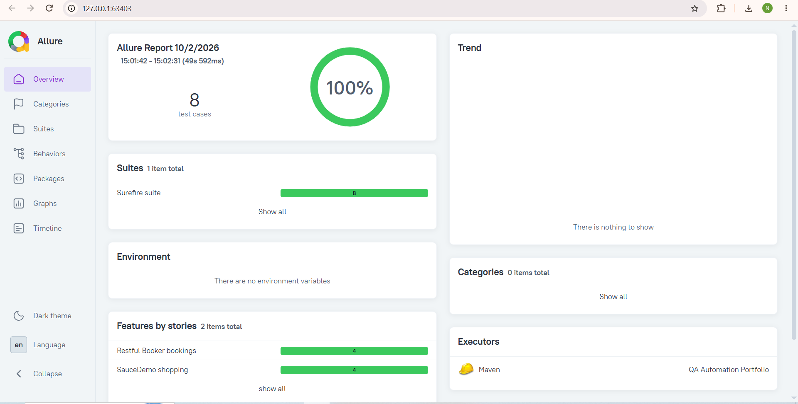
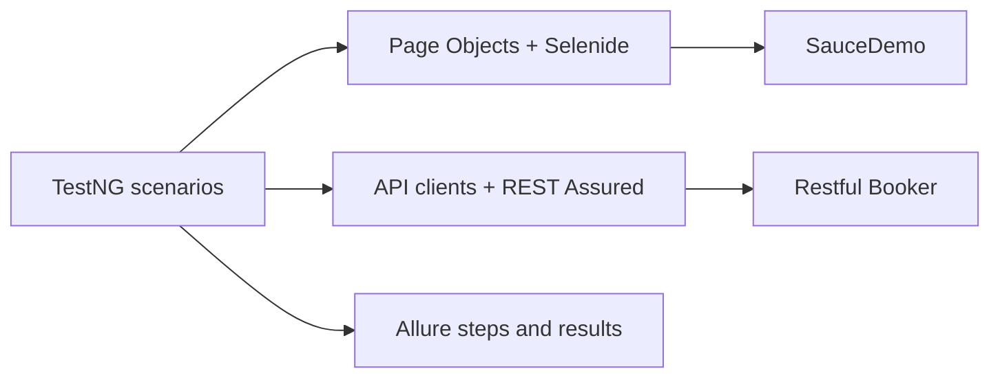

# QA Automation Portfolio

[](https://adoptium.net/temurin/releases/?version=17)
[](https://maven.apache.org/)
[](https://github.com/plombir774/QA_Automation/actions/workflows/tests.yml)

A Java 17 QA automation portfolio combining browser testing and REST API testing.
Eight automated TestNG scenarios cover shopping workflows in [SauceDemo](https://www.saucedemo.com/)
and booking CRUD operations in [Restful Booker](https://restful-booker.herokuapp.com/).
The project demonstrates test design, reusable automation code, CI execution, and failure diagnostics using public demo services.

## What this project demonstrates

- Page Objects with stable `data-test` selectors and Selenide automatic waits.
- API clients, token authentication, and typed request/response models.
- Assertions on UI behavior, HTTP status, content type, and complete booking data.
- Independent tests with fresh browser sessions and test-owned booking IDs.
- GitHub Actions CI and Allure steps, HTTP attachments, and UI failure evidence.

## Allure report



The report shows successful UI and API automated test execution with Allure steps and attachments.

## Tech stack

| Technology | Purpose |
| --- | --- |
| Java 17 / Maven | Language, dependencies, and build lifecycle |
| TestNG | Test execution, lifecycle, groups, and assertions |
| Selenide | Browser automation and automatic waits |
| REST Assured | HTTP requests and response validation |
| Jackson / Lombok | JSON mapping and concise Java models |
| Allure | Test reports, steps, and attachments |
| GitHub Actions | Automated test runs and failure artifacts |

## UI test coverage

[UI scenarios](src/test/java/ui/SauceDemoSmokeTest.java) run in headless Chrome by default.

| Scenario | Verification |
| --- | --- |
| Successful login | `standard_user` reaches the inventory URL and product catalog |
| Locked-out login | `locked_out_user` receives the exact error message and stays on the login form |
| Add to cart | Badge shows `1`; the cart contains the selected Sauce Labs Backpack with quantity `1` |
| Complete checkout | Submit `Nikita`, `Test`, `6000`; verify the order overview and successful order confirmation |

## API test coverage

Each [API scenario](src/test/java/api/RestfulBookerSmokeTest.java) creates its own booking.
Update and delete obtain a token from `POST /auth` and send it as a cookie.

| Scenario | Verification |
| --- | --- |
| Create | HTTP 200, JSON content type, positive booking ID, and all returned fields |
| Get | HTTP 200, JSON content type, and stored data matching the creation request |
| Update | HTTP 200 and all changed fields in both the PUT response and a subsequent GET |
| Delete | HTTP 201 with `Created`, followed by HTTP 404 with `Not Found`; both responses are plain text |

## Architecture



Tests describe scenarios and expected behavior. Page Objects own UI selectors, actions, and page assertions;
API clients execute requests and return responses for the tests to validate.
Configuration, Java models, and reusable test data support both automation layers.

## Project structure

```text
.github/workflows/tests.yml       # CI workflow
pom.xml                          # Dependencies and Maven plugins
src/test/
|-- java/
|   |-- ui/                      # SauceDemo scenarios
|   |-- pages/                   # Login, inventory, cart, and checkout pages
|   |-- api/
|   |   |-- client/              # BookingApiClient and AuthApiClient
|   |   `-- RestfulBookerSmokeTest.java
|   |-- models/                  # Booking and authentication payloads
|   |-- config/                  # Selenide and REST Assured settings
|   `-- utils/                   # TestData factories
`-- resources/allure.properties  # Allure results location
```

## Run locally

Install **JDK 17**, **Maven 3.9+**, and **Google Chrome**. Internet access is required for dependencies,
browser driver downloads, and the demo services. Set `JAVA_HOME` to JDK 17;
both version commands below should report Java 17.

```shell
git clone https://github.com/plombir774/QA_Automation.git
cd QA_Automation
java -version
mvn -version
mvn clean test
```

Run one group or show the browser:

```shell
mvn test "-Dgroups=ui"
mvn test "-Dgroups=api"
mvn test "-Dgroups=ui" "-Dselenide.headless=false"
```

Quoted `-D` arguments work in PowerShell as well. Selenide/Selenium Manager resolves the browser driver.
Each UI test closes its browser, including after failures.

Base URLs and browser settings are in [UiConfig](src/test/java/config/UiConfig.java)
and [ApiConfig](src/test/java/config/ApiConfig.java). Override them with `-Dui.baseUrl=...`,
`-Dapi.baseUrl=...`, or `-Dselenide.browser=edge`; alternative URLs must expose the same application contracts.

## GitHub Actions CI

The [QA Automation Tests workflow](.github/workflows/tests.yml) runs on pushes to `main`,
pull requests targeting `main`, and manual runs. It uses `ubuntu-latest`, Temurin Java 17,
and Maven dependency caching to execute `mvn --batch-mode clean test`.

The test step has a 10-minute timeout within a 15-minute job. Failed runs remain failed after artifact upload.
In the run's **Artifacts** section, download **test-reports** for the available Surefire reports,
Allure results, and Selenide screenshots/page sources. Failure artifacts are retained for **7 days**.
The suite uses public demo credentials and requires no repository secrets.

## Development workflow

Feature branch → Pull Request → GitHub Actions → review → merge to `main`.
CI runs automated tests on pull requests before changes are reviewed and merged into `main`.

## Allure reporting

After a test run, including a failed run, generate and open the report:

```shell
mvn allure:serve
```

Stop the server with `Ctrl+C`. To generate HTML without starting a server, run `mvn allure:report`.
The Maven plugin downloads the configured Allure 2 CLI automatically; no separate Allure installation is needed.

| Output | Location |
| --- | --- |
| Maven/TestNG results | `target/surefire-reports/` |
| Raw Allure results and HTTP attachments | `target/allure-results/` |
| Generated Allure HTML report | `target/site/allure-maven-plugin/` |
| Selenide failure screenshots and page sources | `target/selenide-reports/` |

Reports include readable steps, API request/response attachments, and screenshots/page sources for failed Selenide checks.
Generated output is ignored by Git. Use `mvn clean test` to start with fresh results.

## Scope

This portfolio covers eight automated TestNG scenarios against public demo applications. Network availability and shared demo data
can affect results. The delete test removes its booking; the other API tests leave their records for the demo service's reset.
